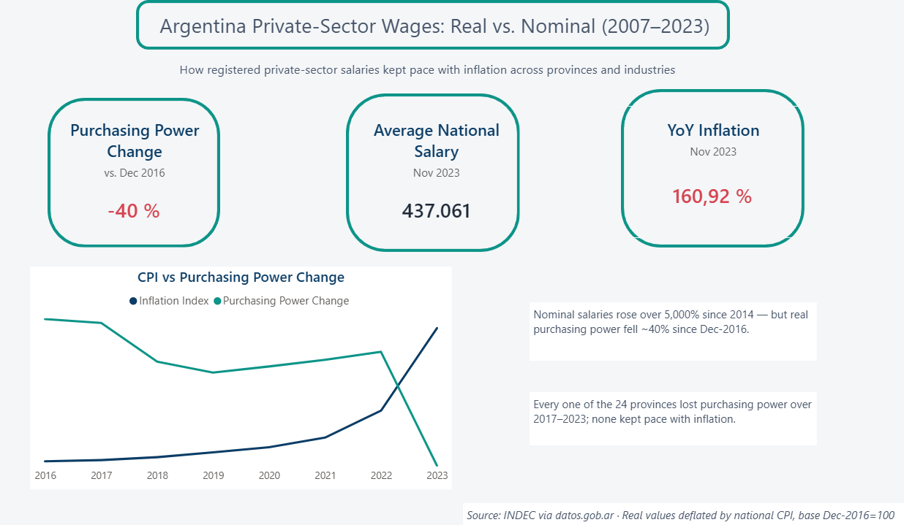
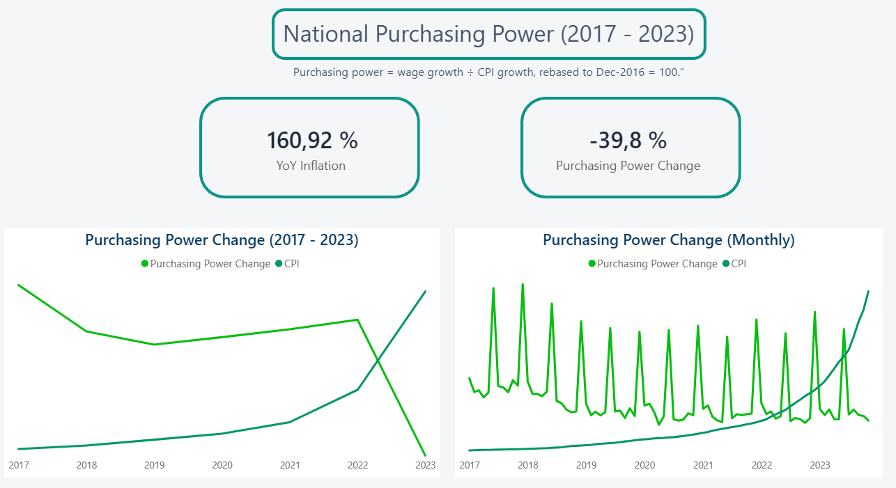
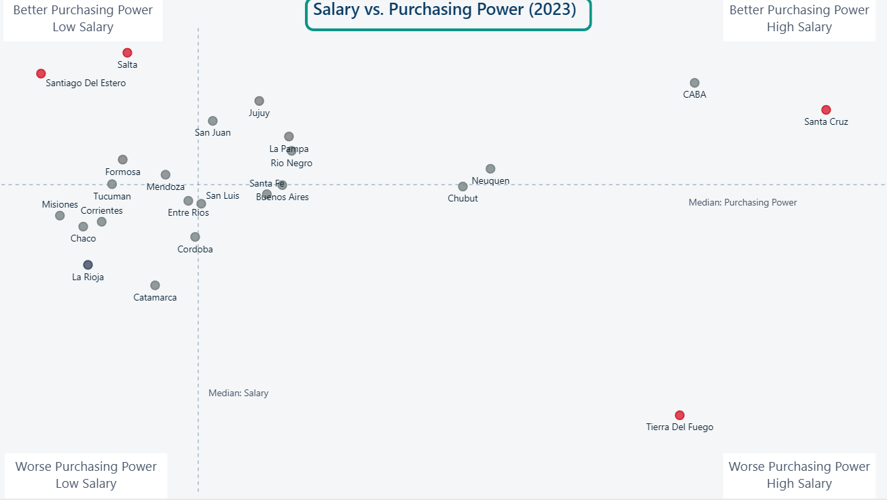

# Argentina Employment Analytics

An end-to-end data pipeline and Power BI dashboard analyzing the evolution of private-sector wages and employment in Argentina, and how they relate to inflation across provinces, departments, and economic activities.



## Business / Analytical Problem

Nominal wage figures in a high-inflation economy like Argentina's are misleading on their own — a raw peso increase can still represent a real loss in purchasing power. This project builds a full pipeline from raw government statistics to an interactive dashboard that compares **nominal** and **inflation-adjusted (real)** private-sector wages across time, geography, and industry.

## Key Questions

- How did private-sector wages evolve over time, in nominal and real terms?
- How did employment evolve over time?
- How do wages differ between provinces and departments?
- How do wages differ across economic activities?
- How did wages evolve relative to inflation (purchasing power)?

## Data Sources

All datasets are official Argentine government statistics published on [datos.gob.ar](https://datos.gob.ar):

| Dataset | Format | Period | Used for |
|---|---|---|---|
| `salario-promedio-por-departamento` | XLSX | 2014–2023 | Monthly average private-sector salary by department |
| `indice-precios-al-consumidor-...-mensual` (IPC) | CSV | Dec 2016 – present | National CPI (base Dec-2016=100) |
| `clae_agg` | CSV | static | Economic activity classification dictionary (CLAE) |
| `puestos_priv` | CSV | 2007–2023 | Monthly registered private-sector jobs by province and activity |
| `w_mean_privado_mensual_por_clae2` | CSV | 2007–2023 | Monthly average wage by economic activity (national) |

## Data Period

Coverage varies by dataset — see [Data Limitations](#data-limitations). Overall analysis window: **2007–2023**, with real/inflation-adjusted metrics computable only from **December 2016** onward, when the CPI series begins.

## Technologies

Python (pandas, SQLAlchemy) · PostgreSQL · Power BI (Power Query, DAX) · python-dotenv

## Architecture

```text
Official Government Datasets (datos.gob.ar)
              │
              ▼
        Python (pandas)
     extract → transform → load
              │
              ▼
         PostgreSQL
      (star-schema data model)
              │
              ▼
          Power BI
              │
              ▼
    7-page interactive dashboard
```

Full breakdown of each component: [`docs/architecture.md`](docs/architecture.md).

## ETL Process

- **`scripts/extract.py`** — reads the 5 source files through a single reusable validated-read helper.
- **`scripts/transform.py`** — reshapes and cleans each source into its target grain; builds all 4 dimensions.
- **`scripts/load.py`** — truncates and reloads all tables inside a single transaction.
- **`scripts/main.py`** — orchestrates the full run.

## Database Schema

**Dimensions:** `dim_provincia`, `dim_departamento`, `dim_fecha`, `dim_clae`
**Facts:** `fact_salarios`, `fact_ipc`, `fact_puestos_priv`, `fact_salario_clae`

Star schema with composite primary keys on fact tables reflecting their true grain, foreign keys enforcing referential integrity, and `CHECK` constraints validating domain rules (non-negative wages, valid month/quarter ranges). Full DDL: [`sql/create_tables.sql`](sql/create_tables.sql). QA queries: [`sql/validations.sql`](sql/validations.sql). Analytical queries (rankings, YoY variation, deflated wages in raw SQL): [`sql/analysis.sql`](sql/analysis.sql). Full column-level reference: [`docs/data_dictionary.md`](docs/data_dictionary.md).

| Fact table | Grain |
|---|---|
| `fact_salarios` | month × department |
| `fact_ipc` | month (national) |
| `fact_puestos_priv` | month × province × economic activity |
| `fact_salario_clae` | month × economic activity (national) |

## Power BI Dashboard

7 pages: **Overview**, *Evolución salarial por provincia*, *Ranking de Provincias*, *Poder Adquisitivo Nacional*, *Comparación Salario y Poder Adquisitivo*, *Estructura productiva*, *Salarios por Actividad*.

File: [`dashboard/argentina_analytics.pbix`](dashboard/argentina_analytics.pbix)



## Key Metrics

- Average nominal salary (by province/department/activity)
- Purchasing power (% real change relative to Dec-2016 base)
- Monthly and year-over-year salary/inflation variation
- Employment volume by province and activity
- Province and activity rankings, in both nominal and real terms

## Key Findings

*(As of November 2023, the latest month with complete salary data)*

- **National average private-sector salary: $437,061 ARS/month (nominal)** — up from roughly $7,927 in January 2014, a period that also saw cumulative inflation compound heavily.
- **Real purchasing power fell approximately 40% since December 2016**, despite nominal salaries rising over 5,000% in the same window — a clear illustration of why nominal figures alone are misleading in this context.
- **Nominal and real rankings diverge**: Santa Cruz pays the highest nominal salary ($811,478), but Salta has the strongest *real* purchasing power today, and Santiago Del Estero pays the lowest nominal salary ($324,538). Tierra Del Fuego pays a high nominal salary but has the *worst* purchasing power of any province — high pay does not guarantee it kept pace with inflation.
- **Oil and gas extraction is the highest-paid activity** in the private sector ($2,470,043/month average), well above the second-highest-paid activity.
- **Year-over-year inflation reached 160.9%** as of November 2023.



## Data Limitations

- **CPI/inflation data only starts December 2016**, while employment and activity-wage data go back to 2007 — real/inflation-adjusted metrics are not computable before this date. This is a source-data constraint documented in [`docs/methodology.md`](docs/methodology.md), not a pipeline limitation.
- Government wage/employment statistics reflect **registered private-sector jobs only** — informal employment is not captured.
- CLAE (economic activity classification) codes have been revised over time by INDEC; consistency across the full period is a source-level assumption, not independently re-verified in this project.
- `clae2 = 84` (public administration) is intentionally absent from the private-sector employment dataset.

Full data quality audit, including issues found and fixed during development: [`docs/data_quality.md`](docs/data_quality.md).

## Project Structure

```text
argentina-employment-analytics/
├── data/               # instructions for obtaining source files (not committed)
├── scripts/            # ETL pipeline (extract, transform, load, main, database)
├── sql/                # DDL, validation, and analytical queries
├── dashboard/          # Power BI file
├── docs/               # architecture, data dictionary, methodology, data quality
├── screenshots/        # dashboard screenshots
├── .env.example
├── .gitignore
├── requirements.txt
└── README.md
```

## Installation

```bash
git clone https://github.com/<your-username>/argentina-employment-analytics.git
cd argentina-employment-analytics
python -m venv venv
source venv/bin/activate  # Windows: venv\Scripts\activate
pip install -r requirements.txt
```

## Configuration

Copy `.env.example` to `.env` and fill in your PostgreSQL credentials and the local paths to the source data files:

```env
DB_HOST=localhost
DB_PORT=5432
DB_NAME=database_name
DB_USER=postgres_user
DB_PASSWORD=your_password

DATA_FOLDER=data_raw
DATA_FILE=Salario-promedio-por-departamento.xlsx
IPC_FILE=indice-precios-al-consumidor-nivel-general-base-diciembre-2016-mensual.csv
CLAE_FILE=clae_agg.csv
PUESTOS_FILE=puestos_priv.csv
SALARIO_CLAE_FILE=w_mean_privado_mensual_por_clae2.csv
```

Download the raw source files from [datos.gob.ar](https://datos.gob.ar) into the folder set by `DATA_FOLDER` (see [`data/README.md`](data/README.md)) — they are not committed to this repository.

## How to Run the ETL

```bash
psql -U your_user -d your_db -f sql/create_tables.sql
python scripts/main.py
```

## Reproducing the Project

1. Set up PostgreSQL and create an empty database.
2. Run `sql/create_tables.sql` to build the schema.
3. Configure `.env` (see above).
4. Run `python scripts/main.py` to populate the database.
5. Run `sql/validations.sql` to confirm data integrity.
6. Open `dashboard/argentina_analytics.pbix` in Power BI Desktop and point it at your local database.

## SQL

- [`sql/create_tables.sql`](sql/create_tables.sql) — DDL for the full star schema.
- [`sql/validations.sql`](sql/validations.sql) — data-quality checks: duplicate keys, orphaned foreign-key references, null values, date ranges, and expected distinct counts (e.g., 24 provinces). Results documented in [`docs/data_quality.md`](docs/data_quality.md).
- [`sql/analysis.sql`](sql/analysis.sql) — analytical queries answering business questions directly in SQL (provincial ranking with `RANK()`, year-over-year variation with `LAG()`, top-paying activities via a CTE, salary deflated by CPI).

## Future Improvements

- Automated data-quality checks as part of the pipeline (rather than manual SQL review)
- Incremental loading instead of full truncate-and-reload
- A `dim_clae3` table modeled at its correct grain, for finer activity drill-down
- Regional (rather than only national) inflation adjustment, using the regional CPI series already present in the source data

## Disclaimer / Data Source Attribution

All data used in this project is sourced from official Argentine government publications via [datos.gob.ar](https://datos.gob.ar) (Ministerio de Economía / INDEC). This is an independent portfolio project and is not affiliated with or endorsed by any government agency.

**Note on language:** the Power BI dashboard (tables, DAX measures, visuals)
is in Spanish, matching the source data and its primary audience
(Argentina/LATAM). Project documentation is in English for broader
portfolio accessibility.
